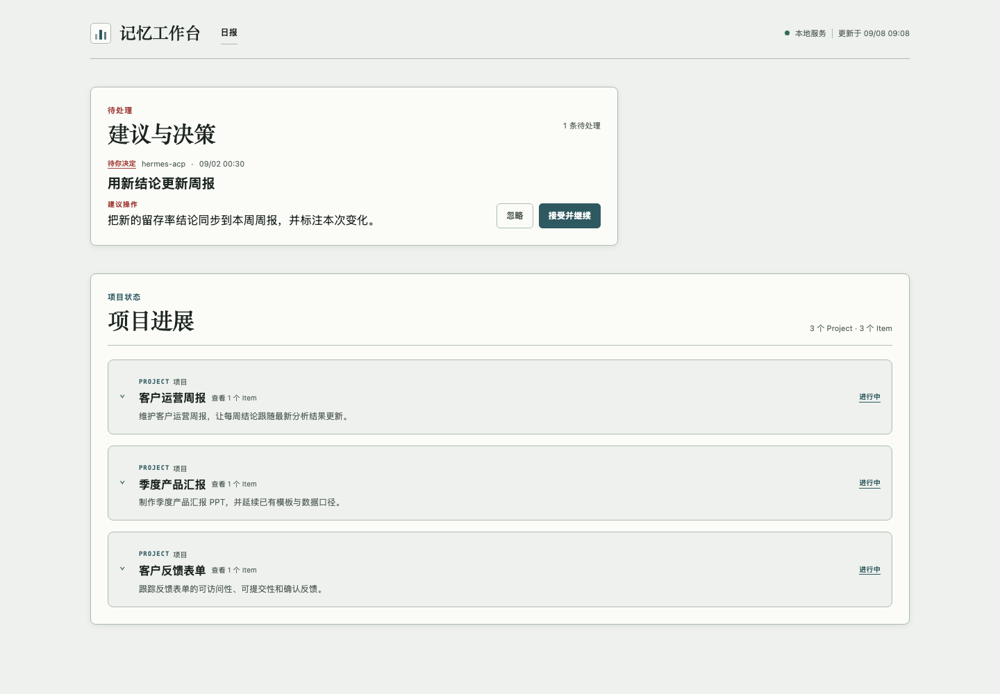
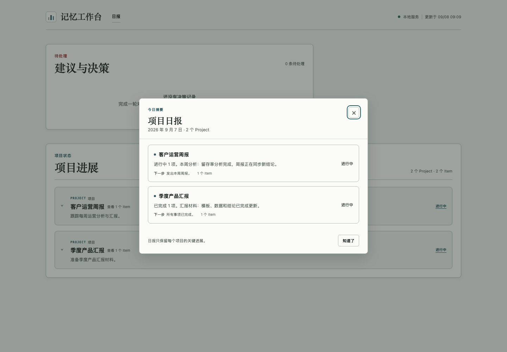

# Proactive Agent

[English](README.md) · 简体中文

Proactive Agent 从你与 AI 的多轮对话中持续整理项目进展，并提出有用的下一步建议，由你决定接受或忽略。

## 它能帮你做什么

它从已接入的对话中整理每个项目的目标、最新进展、阻塞和下一步。工作台集中展示多个项目，展开后可以看到下面的事项与进度条；随着新的进展被记录，事项状态与进度条也会更新。

发现值得跟进的事情时，它会在项目上方展示一条简短建议。你可以接受，让助手在仍保持连接的原对话中继续处理；也可以忽略，不执行建议中的动作。

### 复用之前的工作

做新任务时，之前用过的材料可能仍然有用。它会结合当前任务，提醒你复用之前分享过的相关模板、报告或已有结论。例如，准备季度汇报时，可以沿用上季度 PPT 的结构，并补入最新数据，减少重复整理。


### 更新相关材料

新信息不仅能回答眼前的问题，也可能补充或改变之前的判断。它可以把新发现与已有材料联系起来，提醒哪些内容值得更新。例如，新的留存分析得出了不同判断，之前写好的周报也能据此调整。



### 用日报快速了解进展

多个项目同时推进时，不必每天逐个翻找聊天记录。它会自动汇总各项目的重点进展和下一步，在当天第一次打开工作台时展示日报。你可以关闭弹窗，也可以随时从“日报”入口重新查看，无需专门发消息索要。



## 如何开始

改名后的 `sn-proactive-agent` 已发布到 [GitHub `v0.1.3` Release](https://github.com/OpenSenseNova/SenseNova-Skills-ProactiveAgent/releases/tag/v0.1.3)。目前还未发布到 PyPI；请按 [安装 Skill](skills/sn-proactive-agent/SKILL.md) 中的说明下载并安装 Release 中经过校验的 wheel。

让 Agent 按照 [安装 Skill](skills/sn-proactive-agent/SKILL.md) 帮你安装服务并接入助手，也可以自行参考 [安装指南](skills/sn-proactive-agent/references/install/overview.md)。

完成接入后，启动服务并保持运行：

```sh
sn-proactive-agent serve --web-only
```

如果接入的是 Hermes，在另一个终端打开它：

```sh
hermes --tui --accept-hooks
```

打开 [工作台](http://127.0.0.1:8080/)，查看建议、项目进展和日报。

---

记录保存在本地；AI 处理时，相关对话和项目内容可能发送至你配置的模型服务。
